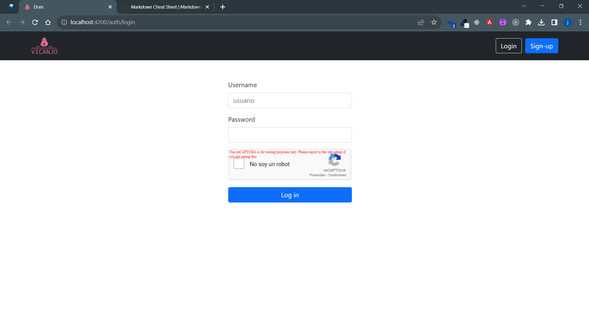
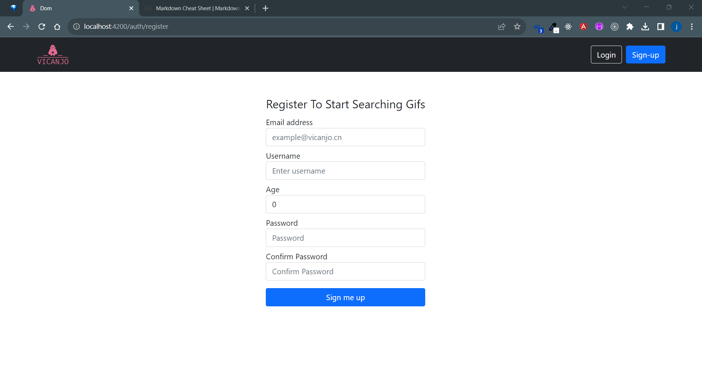
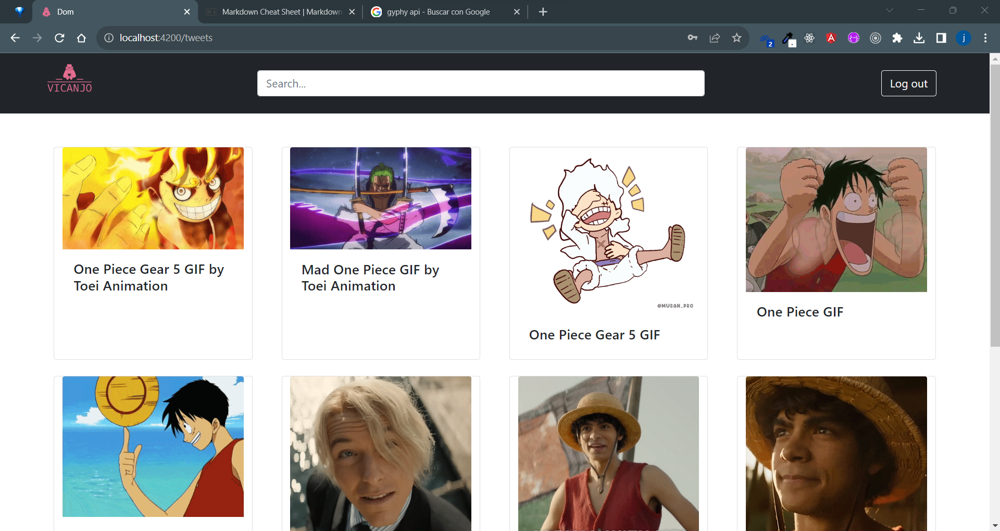

# Prueba becario 1.

En esta prueba se solicito hacer, 3 pantallas diferentes:

    1. Un login donde el usuario pueda iniciar sesión. Este login debe contar con una recaptcha.
    2. Un regitro que tenga 5 campos diferentes.
    4. Una página de busqueda donde el usuario pueda ingresar una palabra y con eso se obtengan gifs y se muestre el resultado en pantalla.

Para realizar la prueba se utilizo Angular y boostrap.

## Proyecto

Puede clonar este proyecto y hacer uso de el con los siguientes comandos.

1.  Una vez clonado
    `npm i` para instalar dependencias
2.  `ng serve -o ` o `npm start` para correr el programa y ver la ejecución en su navegador web.

## Login

Para esta pantalla se creo un formulario donde se pide usuario y contraseña, a demas de agregar la recaptcha.
Para la recaptcha se utilizo la versión dos con una api key de prueba.

Imagen del resultado.

El login cuenta con validaciones de usuario existente, contraseña correcta y recaptcha.

## Registro

Para el registro se creo un formulario reactivo, donde se pide el username, email, edad y contraseña al usuario.
Todos los campos tienen validaciones y se almacenan los datos de inicio de sesión en localstorage.

Imagen Registro.

## Search

Para la busqueda se utilizo un form donde se le permite al usuario ingresar texto, con base en esto se buscan diferentes gifs en giphy, utilizando su api https://developers.giphy.com/

Una vez que el usuario ingreso una palabra se lanza la petición y se obtiene una lista que se limito a 12 gifs, cuando se obtiene la respuesta los gifs obtenidos e muestran en pantalla con un titulo decriptivo.

Imagen Search.

